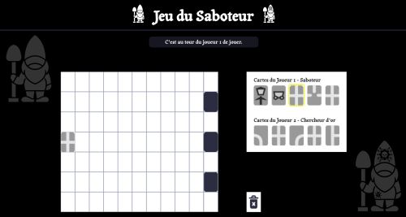
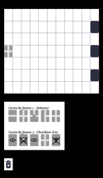

# Jeu du Saboteur 

## 1. Description 

Implémentation JavaScript du jeu de société Saboteur, un jeu de stratégie dans lequel des nains chercheurs d'or construisent un tunnel de cartes pour atteindre le trésor, tandis que des saboteurs infiltrés tentent de les en empêcher.

Cette version numérique permet de jouer à 2 joueurs (1 nain Chercheur d'or et 1 nain Saboteur) directement dans le navigateur avec gestion automatique des règles et détection de la victoire.

---

## 2. But du jeu

#### Nain Chercheur d'or

Construire un tunnel de cartes depuis la carte de départ jusqu'à la carte trésor (cachée parmi 3 cartes retournées).

#### Nain Saboteur

Empêcher le nain Chercheur d'or d'atteindre le trésor en :
- posant des impasses dans le tunnel, 
- cassant les outils du nain Chercheur d'or (pioche, lampe, chariot), 
- détruisant des cartes chemin déjà posées.

--- 

## 3. Règles du jeu

#### Mise en place

- Le plateau commence avec une carte de départ à gauche,
- 3 cartes but (dont 1 trésor) sont placées face cachée à droite,
- chaque joueur reçoit 5 cartes.

#### Tour de jeu

À chaque tour, le joueur doit faire une action :

- poser une carte chemin sur le plateau connectée au réseau existant pour créer un tunnel
- jouer une carte action sur un autre joueur ou soi-même pour :
   - saboter : casser un outil (pioche, lampe, chariot)
   - réparer : réparer un outil cassé
   - regarder : voir secrètement une des cartes but
   - détruire : retirer une carte chemin du plateau
- défausser une carte s'il ne peut rien jouer


puis piocher une nouvelle carte pour toujours avoir 5 cartes en main.

#### Fin de la partie 

La partie se termine quand :
- soit un chemin connecte la carte de départ à la carte trésor sans interruption → Victoire du Chercheur d'or

- soit la pioche est vide → Victoire du Saboteur

---

## 4. Comment jouer ?

#### Installation

- Cloner le projet `git clone https://github.com/Melissa-code/saboteur.git`, 
- Ouvrir index.html dans un navigateur ou lancer live server `http://127.0.0.1:5500/saboteur/`.

#### Contrôles

- 1er clic : sélectionner une carte de la main du joueur (bordure jaune autour), 
- 2e clic sur la même carte : faire tourner la carte de 180°, 
- 2e clic ailleurs : jouer la carte 
   - sur le plateau de jeu → poser une carte chemin
   - sur un joueur → jouer une carte action
   - sur la corbeille → défausser la carte

#### Aperçu 

<div style="display: flex; gap: 3rem;">
  
  
</div>

---

## 5. Technologies utilisées

- HTML5
- CSS3
- Canvas
- JavaScript Vanilla

---

## 6. Structure du projet

#### Architecture MVC

```
saboteur/
├── index.html
├── styles/
│   └── style.css
├── js/
│   ├── controller/
│   │   └── Controller.js
│   ├── enum/
│   │   ├── Directions.js
│   │   ├── Actions.js
│   │   └── TypesCibles.js
│   ├── model/
│   │   ├── Game.js
│   │   ├── Card.js
│   │   ├── CardFactory.js
│   │   ├── Cible.js
│   │   └── Player.js
│   └── view/
│       └── View.js
└── images/
    ├── cartes_chemin/
    ├── cartes_action/
    └── treasure.svg
```

#### Patterns POO

[Voir la documentation technique](./docs/TECHNICAL.md)

- Pattern MVC pour séparation des responsabilités
- DFS pour la détection de victoire
- Factory Pattern pour la création de cartes
- Observer Pattern pour Model-View

## 7. Fonctionnalités

- Placer les cartes chemin avec vérification des connexions entre elles
- Faire une rotation des cartes chemin (180°)
- Jouer une carte action (saboter, réparer, supprimer une carte chemin, voir une carte but)
- Détecter automatiquement la victoire
- Afficher le chemin gagnant

---

## 8. Auteur 

Mélissa-code

---

## 9. Licence 

MIT 